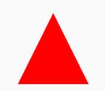

## How to draw a custom shape?

!!! info
    This is the API of version 1.2.0. Newer versions may have a different one

<p align="center">
  
</p>

### GenericShape

You can create custom shapes. One way to do it, is to use **GenericShape**.  Let's see how the triangle is drawn.


```kotlin
private val TriangleShape = GenericShape { size, _ ->
    // 1)
    moveTo(size.width / 2f, 0f)

    // 2)
    lineTo(size.width, size.height)

    // 3)
    lineTo(0f, size.height)
}
```

Inside the GenericShape you can draw your custom shape.
You have access to the **size**-object. This is size of the Composable that the shape is applied to.
You can get the height with **size.height** and the width with **size.width**


1) Initially the painter will start at the top left of the parent composable(0x,0y).
With **moveTo()** you can set the coordinates of the painter. Here the coordinates will be set to the half width of the parent layout
and a 0y coordinate.

2) This will draw a line from the painter coordinates, which were set in **1)**, to the bottom right corner of the parent layout.
The painter coordinates are then automatically set to this corner.

3) This will draw a line to the bottom left corner. GenericShape will implicitly execute the **close()**-function. **close()** will draw a line from the last painter coordinates to the first definied.

### Extend the Shape interface

```kotlin
/**
 * Defines a generic shape.
 */
interface Shape {
    /**
     /**
     * Creates [Outline] of this shape for the given [size].
     *
     * @param size the size of the shape boundary.
     * @param density the current density of the screen.
     *
     * @return [Outline] of this shape for the given [size].
     */
    fun createOutline(size: Size, density: Density): Outline
}
```
You can extend the Shape interface to create your own implementation of Shape. Inside **createOutline** you get the size of the Composable, which the shape is applied to and the density of the screen.
You have to return an instance of **Outline**. Outline is a sealed class with the following subclasses:

* Rectangle(val rect: Rect)
* Rounded(val rrect: RRect)
* Generic(val path: Path)

Take a look at the GenericShape example when you want to understand, how the drawing of a custom shape works.

```kotlin
class CustomShape : Shape {
    override fun createOutline(size: Size, density: Density): Outline {
        val path = Path().apply {
            moveTo(size.width / 2f, 0f)
            lineTo(size.width, size.height)
            lineTo(0f, size.height)
            close()
        }
        return Outline.Generic(path)
    }
}

```
