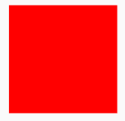
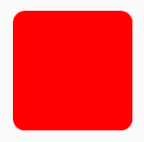

# Shape
A Shape can be used to draw a Composable in specific shape.

!!! info
    This is the API of version 1.0.0-alpha05. Newer versions may have a different one
    
## RectangleShape

<p align="center">
  
</p>

A shape describing the rectangle.

```kotlin
@Composable
fun RectangleShapeDemo(){
    ExampleBox(shape = RectangleShape)
}

@Composable
fun ExampleBox(shape: Shape){
    Column(modifier = Modifier.fillMaxWidth().wrapContentSize(Alignment.Center)) {
        Box(
            modifier = Modifier.preferredSize(100.dp).clip(shape).background(Color.Red)
        )
    }
}
```

## CircleShape

<p align="center">
  
</p>

Circular Shape with all the corners sized as the 50 percent of the shape size.

```kotlin
@Composable
fun CircleShapeDemo(){
    ExampleBox(shape = CircleShape)
}

@Composable
fun ExampleBox(shape: Shape){
     Column(modifier = Modifier.fillMaxWidth().wrapContentSize(Alignment.Center)) {
        Box(
           modifier = Modifier.preferredSize(100.dp).clip(shape).background(Color.Red)
        )
    }
}
```

## RoundedCornerShape

<p align="center">
  
</p>

A shape describing the rectangle with rounded corners.

```kotlin
@Composable
fun RoundedCornerShapeDemo(){
    ExampleBox(shape = RoundedCornerShape(10.dp))
}

@Composable
fun ExampleBox(shape: Shape){
     Column(modifier = Modifier.fillMaxWidth().wrapContentSize(Alignment.Center)) {
        Box(
           modifier = Modifier.preferredSize(100.dp).clip(shape).background(Color.Red)
        )
    }
}
```

## CutCornerShape
<p align="center">
  
</p>

A shape describing the rectangle with cut corners.

```kotlin
@Composable
fun CutCornerShapeDemo(){
    ExampleBox(shape = CutCornerShape(10.dp))
}

@Composable
fun ExampleBox(shape: Shape){
     Column(modifier = Modifier.fillMaxWidth().wrapContentSize(Alignment.Center)) {
        Box(
            modifier = Modifier.preferredSize(100.dp).clip(shape).background(Color.Red)
        )
    }
}
```

## How to draw a custom shape?
[How to create a custom shape](../cookbook/how_to_create_custom_shape.md)