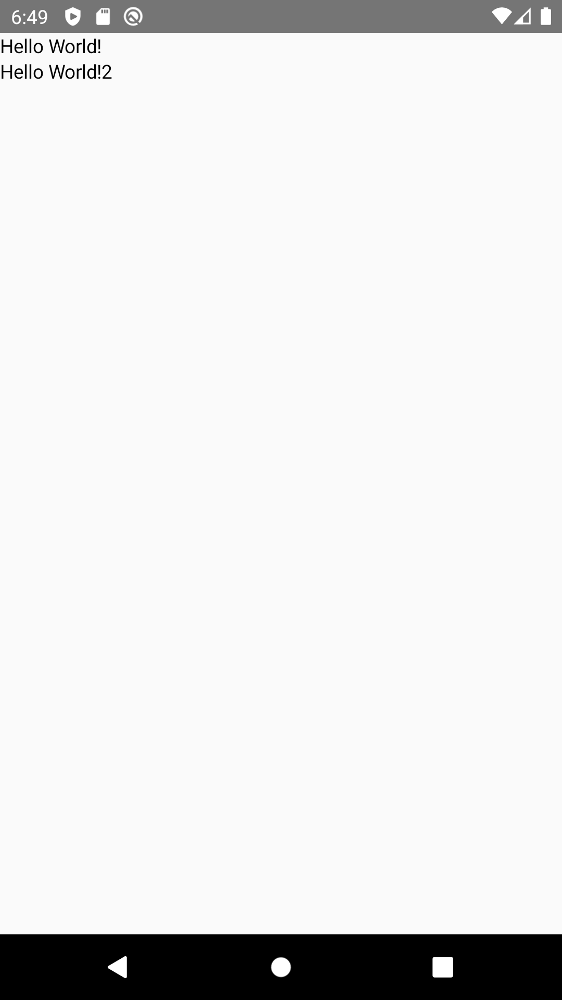

# Column

!!! info
    This is the API of version 1.0.0-alpha02. Newer versions may have a different one

A Column will show each child below the previous children. It's similar to a LinearLayout with vertical orientation.

<p align="left">
  
</p>

```kotlin
@Composable
fun ColumnExample() {
    Column {
        Text("Hello World!")
        Text("Hello World!2")
    }
}

```


## See also:
* [Official Docs](https://developer.android.com/reference/kotlin/androidx/compose/foundation/layout/package-summary#column)
