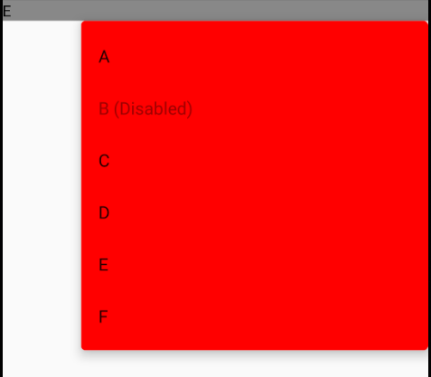

# DropdownMenu

!!! info
    This is the API of version 1.0.0-alpha06. Newer versions may have a different one

<p align="center">
  
</p>

```kotlin
@Preview
@Composable
fun DropdownDemo() {
    val items = listOf("A", "B", "C", "D", "E", "F")
    val disabledValue = "B"
    var showMenu by remember { mutableStateOf( false ) }
    var selectedIndex by remember { mutableStateOf(0) }

    DropdownMenu(
            toggle = {
                Text(items[selectedIndex], modifier = Modifier.fillMaxWidth().clickable(onClick = { showMenu = true }))
            },
            expanded = showMenu,
            onDismissRequest = { showMenu = false },
            toggleModifier = Modifier.fillMaxWidth().background(Color.Gray),
            dropdownModifier = Modifier.fillMaxWidth().background(Color.Red)
    ) {
        items.forEachIndexed { index, s ->
            DropdownMenuItem(
                    enabled = (s != disabledValue),
                    onClick = {
                        selectedIndex = index
                        showMenu = false
                    }
            ) {
                val disabledText = if (s == disabledValue) {
                    " (Disabled)"
                } else {
                    ""
                }
                Text(text = s + disabledText)
            }
        }
    }
}
```


## See also:
* [Material.io](https://material.io/components/menus#dropdown-menu)
* [Official Docs](https://developer.android.com/reference/kotlin/androidx/compose/material/package-summary#dropdownmenu)
* [Full Example Code](https://github.com/Foso/Jetpack-Compose-Playground/blob/master/compose/src/main/java/de/jensklingenberg/jetpackcomposeplayground/ui/github/material/dropdown/DropdownDemo.kt)
