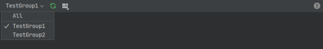

# Preview
## Preview
You can use the **@Preview** annotation to preview compose functions inside Android Studio.
Preview can not be used on Composables that have parameters without a default parameter.

```kotlin

@Preview
@Composable
fun TextDemo(){
    Text("Hello")
}

@Preview(name = "MyPreviewName")
@Composable
fun TextDemo2(){
    Text("Hello")
}

```
Android Studio Preview
<p align="center">
  
</p>


## Group Previews

```kotlin
 @Preview(group = "TestGroup1")
```
The Preview annotation has a group parameter. You can use it to set a group name to your previews.
<p align="center">
  
</p>

The layout preview will now have an option to filter all the previews by the group name.