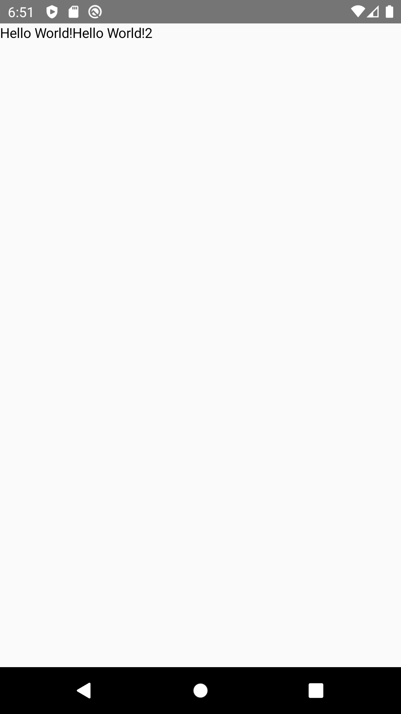
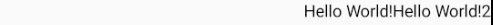

# Row

A Row will show each children next to the previous children. It' similar to a LinearLayout with horizontal orientation.


<p align="left">
  
</p>

```kotlin
@Composable
fun RowExample() {
    Row {
        Text("Hello World!")
        Text("Hello World!2")
    }
}
```

## How to align row childrens with equal width
```kotlin
@Composable
fun RowExample() {
    Row(arrangement = Arrangement.SpaceEvenly) {
        Text("Hello World!")
        Text("Hello World!2")
    }
}
```

Row takes an **Arrangement** parameter. When you set it to **Arrangement.SpaceEvenly**, the children of Row will equal a width.

<p align="left">
  
</p>

## How to align row childrens in center
```kotlin
@Composable
fun RowExample() {
    Row(arrangement = Arrangement.Center) {
        Text("Hello World!")
        Text("Hello World!2")
    }
}
```
Row takes an Arrangement parameter. When you set it to **Arrangement.Center**, the children of Row will aligned in the center of Row.

<p align="left">
  
</p>

## How to align row childrens at end
```kotlin
@Composable
fun RowExample() {
    Row(arrangement = Arrangement.End) {
        Text("Hello World!")
        Text("Hello World!2")
    }
}
```
Row takes an Arrangement parameter. When you set it to **Arrangement.End**, the children of Row will aligned at the end of Row.

<p align="left">
  
</p>


## See also:
* [Official Docs](https://developer.android.com/reference/kotlin/androidx/ui/layout/package-summary#row)
* [Compose Academy/Row](https://compose.academy/academy/layout/row/)
