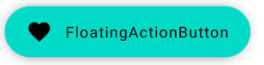

# FloatingActionButton

!!! info
    This is the API of version 1.0.0-alpha03. Newer versions may have a different one

## FloatingActionButton


```kotlin
@Composable                                               
fun FloatingActionButtonDemo() {                          
    FloatingActionButton(onClick = { /*do something*/}) { 
        Text("FloatingActionButton")                      
    }                                                     
}                                                         
```

<p align="center">
  
</p>

## ExtendedFloatingActionButton

```kotlin
@Composable                                               
fun ExtendedFloatingActionButtonDemo() {                          
     ExtendedFloatingActionButton(                               
         icon = { Icon(Icons.Filled.Favorite) },                 
         text = { Text("FloatingActionButton") },                
         onClick = { /*do something*/ },
         elevation = 8.dp                              
     )                                                                                                             
}                                                         
```

<p align="center">
  
</p>

## See also:
* [Official Docs](https://developer.android.com/reference/kotlin/androidx/compose/material/package-summary#floatingactionbutton)